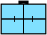
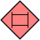
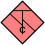

# Mil-Symbol-Converter

Converts **MIL-STD-2525C** letter symbol identification codes (15 characters) to

- the 20-digit numeric SIDC of **MIL-STD-2525D** (version 10, or 11 = Change 1),
- **APP-6(D)**, **MIL-STD-2525E** (Change 1) and **APP-6(E)** (Change 2), where the code and its meaning
  can be checked in a catalog of that edition,
- the 12-character letter form read by renderers such as milsymbol (`prefix-12` profile),

and converts numeric codes back to 2525C.

Each result says how faithful it is (`exact`, `equivalent`, `lossy`, `approximate`, `ambiguous`,
`unsupported`), which datasets support it, and why it failed if it did. By default the converter
does not guess: it never picks a "closest" symbol, never replaces `*` with a default, and never
treats APP-6D as identical to 2525D. Approximate matching is available only on request
(`fuzzy: true`), with a measured certainty.

- [Standards research](docs/standards-research.md): field layouts, the 12-character question,
  APP-6D vs 2525D, existing converters
- [Conversion rules](docs/conversion-rules.md)
- [Limitations and coverage](docs/limitations.md)

## Examples

The symbols are drawn by [milsymbol](https://github.com/spatialillusions/milsymbol) from each code;
every code, quality and name comes from running the converter
(`npx tsx scripts/render-readme-examples.ts` regenerates both tables). The drawings are a visual
sanity check; the mappings are verified against the standards' tables and the source datasets.

### Standards side by side

Rows 6-9 show the pending standard identity (yellow, dashed), planned status (dashed), a
headquarters staff and a task force. The second column is how the
[symbol.army 2525C list](https://www.symbol.army/doc/en/more/list-of-mil-std-2525c-symbols/) prints
the same symbol. That list only prints friend/present codes with typographic dashes and a `*****`
tail; pasted as is, each converts like the friend/present version of the input once the `*`
fields are given as options (see [Codes copied from web lists](#codes-copied-from-web-lists)).

| MIL-STD-2525C                                    | symbol.army list                               | Symbol                                                                       | MIL-STD-2525D                                                                                 | Symbol                                                                            | APP-6D                                                                                              | Symbol                                                                             | MIL-STD-2525E                                                                                       | Symbol                                                                            |
| ------------------------------------------------ | ---------------------------------------------- | ---------------------------------------------------------------------------- | --------------------------------------------------------------------------------------------- | --------------------------------------------------------------------------------- | --------------------------------------------------------------------------------------------------- | ---------------------------------------------------------------------------------- | --------------------------------------------------------------------------------------------------- | --------------------------------------------------------------------------------- |
| `SFGPUCIC---E---`<br><sub>INFANTRY ARCTIC</sub>  | `SFGPUCIC–*****`                               |  | `10031000151211000002`<br>exact<br><sub>Infantry, Arctic</sub>                                |  | `10031000151211000002`<br>equivalent<br><sub>Infantry, Arctic</sub>                                 |  | `15031000151211000002`<br>equivalent<br><sub>Infantry, Arctic</sub>                                 |  |
| `SHAPMFB--------`<br><sub>BOMBER</sub>           | `SFAPMFB—*****`<br><sub>friend, present</sub>  |  | `10060100001101030000`<br>exact<br><sub>Bomber</sub>                                          |  | `10060100001101030000`<br>equivalent<br><sub>Bomber</sub>                                           |  | `15060100001101030000`<br>equivalent<br><sub>Bomber</sub>                                           |  |
| `SNSPCLFF-------`<br><sub>FRIGATE/CORVETTE</sub> | `SFSPCLFF–*****`<br><sub>friend, present</sub> |  | `10043000001202040000`<br>exact<br><sub>Frigate</sub>                                         |  | `10043000001202040000`<br>equivalent<br><sub>Frigate</sub>                                          |  | `15043000001202040000`<br>equivalent<br><sub>Frigate</sub>                                          |  |
| `SFGPIXH---H----`<br><sub>HOSPITAL</sub>         | `SFGPIXH—H****`                                |  | `10032000001207020000`<br>exact<br><sub>Medical Treatment Facility (Hospital)</sub>           |  | `10032000001207020000`<br>equivalent<br><sub>Medical Treatment Facility (Hospital)</sub>            |  | `15032000001207020000`<br>equivalent<br><sub>Medical Treatment Facility (Hospital)</sub>            |  |
| `SHGPEVAT-------`<br><sub>TANK</sub>             | `SFGPEVAT–*****`<br><sub>friend, present</sub> |  | `10061500001202000000`<br>exact<br><sub>Tank</sub>                                            |  | `10061500001202000000`<br>equivalent<br><sub>Tank</sub>                                             |  | `15061500001202000000`<br>equivalent<br><sub>Tank</sub>                                             |  |
| `SPGPUCI--------`<br><sub>INFANTRY</sub>         | `SFGPUCI—*****`<br><sub>friend, present</sub>  |  | `10001000001211000000`<br>exact<br><sub>Infantry</sub>                                        |  | `10001000001211000000`<br>equivalent<br><sub>Infantry</sub>                                         |  | `15001000001211000000`<br>equivalent<br><sub>Infantry</sub>                                         |  |
| `SFGAUCI----F---`<br><sub>INFANTRY</sub>         | `SFGPUCI—*****`<br><sub>friend, present</sub>  |  | `10031010161211000000`<br>exact<br><sub>Infantry</sub>                                        |  | `10031010161211000000`<br>equivalent<br><sub>Infantry</sub>                                         |  | `15031010161211000000`<br>equivalent<br><sub>Infantry</sub>                                         |  |
| `SFGPUCI---AF---`<br><sub>INFANTRY</sub>         | `SFGPUCI—*****`                                |  | `10031002161211000000`<br>exact<br><sub>Infantry</sub>                                        |  | `10031002161211000000`<br>equivalent<br><sub>Infantry</sub>                                         |  | `15031002161211000000`<br>equivalent<br><sub>Infantry</sub>                                         |  |
| `SHGPUCA---EE---`<br><sub>ARMOR</sub>            | `SFGPUCA—*****`<br><sub>friend, present</sub>  |  | `10061004151205000000`<br>exact<br><sub>Armor/Armored/Mechanized/Self-Propelled/Tracked</sub> |  | `10061004151205000000`<br>equivalent<br><sub>Armor/Armored/Mechanized/Self-Propelled/ Tracked</sub> |  | `15061004151205000000`<br>equivalent<br><sub>Armor/Armored/Mechanized/Self-Propelled/ Tracked</sub> |  |

### Harder cases

What the converter reports when a conversion loses information, is ambiguous, or has no
documented mapping.

| Input                                                             | Symbol                                                                     | Target | Options                                      | Result                                                              | Symbol                                                                                     | Why                                                                                                                                |
| ----------------------------------------------------------------- | -------------------------------------------------------------------------- | ------ | -------------------------------------------- | ------------------------------------------------------------------- | ------------------------------------------------------------------------------------------ | ---------------------------------------------------------------------------------------------------------------------------------- |
| `SFGPUCIC---EUS-`<br><sub>INFANTRY ARCTIC</sub>                   |   | 2525D  | default                                      | no output<br>lossy                                                  | —                                                                                          | Country code US has no field in the 20-digit code: strict mode refuses.                                                            |
| `SFGPUCIC---EUS-`<br><sub>INFANTRY ARCTIC</sub>                   |   | 2525D  | `allowLossy: true`                           | `10031000151211000002`<br>lossy                                     |             | Accepted; `metadata.droppedFields` returns `{ countryCode: "US" }`.                                                                |
| `S*GPUCI---*****`<br><sub>INFANTRY</sub>                          | —                                                                          | 2525D  | default                                      | no output<br>ambiguous                                              | —                                                                                          | Template: positions 2, 11, 12 stand for many symbols, so no output.                                                                |
| `S*GPUCI---*****`<br><sub>INFANTRY</sub>                          | —                                                                          | 2525D  | `affiliation: "H"`<br>`symbolModifier: "-E"` | `10061000151211000000`<br>exact                                     |             | Wildcards filled only from the values you pass.                                                                                    |
| `SFGPUCVRW------`<br><sub>ANTISUBMARINE WARFARE ROTARY WING</sub> |   | 2525D  | default                                      | no output<br>ambiguous                                              | —                                                                                          | Modifier 74 means Antisubmarine Warfare in 2525D (2014) but Palletized Load System in Change 1.                                    |
| `SFGPUCVRW------`<br><sub>ANTISUBMARINE WARFARE ROTARY WING</sub> |   | 2525D  | `preferredSource: "JMSML"`                   | `10031000001206007400`<br>exact                                     |             | You choose which dataset to trust. Note milsymbol draws it as PLS: it uses the Change 1 meaning, which is why there is no default. |
| `SHGPUUSW-------`<br><sub>TELEPHONE SWITCH</sub>                  |   | 2525D  | default                                      | no output<br>unsupported                                            | —                                                                                          | Telephone switch was retired in 2525D; nothing is substituted.                                                                     |
| `SFGPUUL--------`<br><sub>LAW ENFORCEMENT UNIT</sub>              |   | 2525D  | `fuzzy: true`                                | `10031000002000000000`<br>approximate (name-match, certainty 0.938) |             | No mapping; name match with measured certainty.                                                                                    |
| `SFAPMFFI-------`<br><sub>INTERCEPTOR</sub>                       |   | 2525D  | `fuzzy: true`<br>`allowLossy: true`          | `10030100001101040000`<br>lossy (ancestor, certainty 1)             |             | No mapping; falls back to its 2525C parent (Fighter).                                                                              |
| `SFAPMHA--------`<br><sub>ATTACK</sub>                            |  | 2525E  | `extendedSidc: true`                         | `150301000011020006001000000000`<br>equivalent                      |  | 2525E common modifier Attack/Strike needs the 30-digit code.                                                                       |

## Install

The package is not published to the npm registry yet. Install the prebuilt tarball from the
[GitHub releases](https://github.com/Lansenou/Mil-Symbol-Converter/releases); it needs no build and
pulls in no other packages:

```bash
npm install https://github.com/Lansenou/Mil-Symbol-Converter/releases/download/v0.1.0/mil-symbol-converter-0.1.0.tgz
```

`npm install github:Lansenou/Mil-Symbol-Converter` also works, but npm then builds the package on
your machine and installs all development dependencies first (test tools such as jsdom, which need
Node.js 22.22.2+ or 24.15+).

```ts
import { convertSidc15To2525D } from "mil-symbol-converter"; // ESM
const { convertSidc15To2525D } = require("mil-symbol-converter"); // CommonJS
import { useSidcConverter } from "mil-symbol-converter/react"; // React hook and component
```

Requires Node.js 22 or newer. The core has no runtime dependencies; React is an optional peer
dependency used only by `mil-symbol-converter/react`.

Development: `npm install && npm run check` (format, lint, typecheck, tests, build, export check).

## Usage

```ts
import {
  convertSidc15To12,
  convertSidc15To2525D,
  convertSidc15ToApp6D,
  convertSidc,
  convertSidcToAll,
  validateSidc,
  analyzeSidc,
} from "mil-symbol-converter";
```

### Numeric conversion (2525C → 2525D)

```ts
const r = convertSidc15To2525D("SFGPUCIC---E---"); // infantry arctic, friend, present, company
r.output; // "10031000151211000002"
r.matchQuality; // "exact"
r.confidence; // "corroborated" (JMSML and mil-sym-ts agree)
r.metadata?.entity; // "Movement and Maneuver : Infantry"
r.metadata?.modifiers; // ["Arctic"]
```

The same SIDC for APP-6(D) gives the same digits but only `equivalent`. That label means the code
was checked by name in an APP-6(D) catalog, not mapped by an APP-6(D) table:

```ts
convertSidc15ToApp6D("SFGPUCIC---E---").output; // "10031000151211000002" (matchQuality "equivalent")
```

### 12-character form

```ts
convertSidc15To12("SFGPUCIC---E---").output; // "SFGPUCIC---E" (matchQuality "exact")
```

The 12-character form is not a standard. It is positions 1-12, the part that milsymbol and
convert-symbology read. Positions 13-15 hold the country code and order of battle. When they are
set, the result is `lossy`.

### Wildcards

```ts
const t = convertSidc15To2525D("S*GPUCI---*****");
t.success; // false
t.matchQuality; // "ambiguous"
t.ambiguousPositions; // [2, 11, 12]
t.errors[0]; // 'The numeric SIDC needs concrete values at position(s) 2, 11, 12; …
//  Supply affiliation (one of PUAFNSHGWMDLJK), symbolModifier (…)'

convertSidc15To2525D("S*GPUCI---*****", {
  affiliation: "H",
  symbolModifier: "-E",
}).output;
// "10061000151211000000" (hostile infantry company); a warning notes positions 13-15 stay "*"

convertSidc15To12("S*GPUCI---*****", { wildcardPolicy: "preserve" }).output; // "S*GPUCI---**"
```

### Lossy conversion (strict by default)

```ts
const strict = convertSidc15To2525D("SFGPUCIC---EUS-"); // country code US
strict.success; // false
strict.matchQuality; // "lossy"
strict.warnings[0]; // 'The 20-digit SIDC has no field for countryCode "US"; carry it in a text amplifier …'
strict.candidates?.[0].output; // "10031000151211000002"

const ok = convertSidc15To2525D("SFGPUCIC---EUS-", { allowLossy: true });
ok.output; // "10031000151211000002"
ok.metadata?.droppedFields; // { countryCode: "US" }
```

### Unsupported and ambiguous conversions

```ts
convertSidc15To2525D("SHGPUUSW-------").errors[0];
// "No source provides a code with the same meaning for MIL-STD-2525D (version 10):
//  JMSML marks this 2525C symbol as retired (no 2525D counterpart)."

convertSidc15ToApp6D("IHAPSRE--------").matchQuality; // "unsupported" (no SIGINT sets in the APP-6D catalog)

// Land unit modifier 74 means "Antisubmarine Warfare" in 2525D (2014) but
// "Palletized Load System" in 2525D Change 1, so the sources' common digits can't be trusted:
convertSidc("SFGPUCVRW------").matchQuality; // "ambiguous"
convertSidc("SFGPUCVRW------", { preferredSource: "JMSML" }).output; // "10031000001206007400"
```

### Fuzzy mode (approximate, with certainty)

Off by default. When there is no documented mapping, `fuzzy: true` makes a labelled best guess:

```ts
convertSidc15To2525D("SFGPUUL--------"); // LAW ENFORCEMENT UNIT: unsupported (no mapping)
const f = convertSidc15To2525D("SFGPUUL--------", { fuzzy: true });
f.output; // "10031000002000000000" (Land unit : Law Enforcement)
f.matchQuality; // "approximate"
f.fuzzy; // { method: "name-match", certainty: 0.938, basis: '"LAW ENFORCEMENT UNIT" ~ "Law Enforcement" …' }

// No name match: fall back to the nearest mapped 2525C parent (lossy, needs allowLossy)
convertSidc15To2525D("SFAPMFFI-------", { fuzzy: true, allowLossy: true })
  .output;
// "10030100001101040000": INTERCEPTOR -> its parent FIGHTER
```

`certainty` is the measured precision of the matcher on symbols with known mappings
([calibration](docs/limitations.md#fuzzy-certainty)), not a made-up score. With fuzzy mode and
`extendedSidc`, 95.7% of the 2525C symbols convert to 2525D, compared with 89.6% from documented
mappings alone.

### Numeric back to 2525C

```ts
import { convertNumericTo2525C } from "mil-symbol-converter";

convertNumericTo2525C("10031000151211000002").output; // "SFGPUCIC---E---" (exact)
convertNumericTo2525C("15031000151211000002").output; // "SFGPUCIC---E---" (2525E, equivalent)
convertNumericTo2525C("10031000001211000000", { sourceStandard: "APP-6D" }); // version 10 is shared
convertNumericTo2525C("10031000151211000002", { countryCode: "US" }).output; // "SFGPUCIC---EUS-"
```

Every candidate is converted forward again and accepted only if it reproduces the input, so both
directions follow the same rules. A code that several _different_ 2525C symbols convert to is
`ambiguous` rather than guessed.

### All targets at once, validation, analysis

```ts
convertSidcToAll("SFGPUCIC---E---");
// { "LEGACY-12": {...}, "MIL-STD-2525D": {...}, "APP-6D": {...}, "MIL-STD-2525E": {...}, "APP-6E": {...}, "APP-6C": {...} }

validateSidc("SFGPIXH--------").errors[0];
// 'HOSPITAL is an installation (2525C template S*G*IXH---H****); position 11 must be "H". Did you mean SFGPIXH---H----?'

analyzeSidc("S*GPUCI---*****").wildcards; // which option resolves each "*" and how many values it can take
```

### Options

| Option                                                                    | Default         | Meaning                                                                                                        |
| ------------------------------------------------------------------------- | --------------- | -------------------------------------------------------------------------------------------------------------- |
| `targetStandard`                                                          | `MIL-STD-2525D` | for `convertSidc`                                                                                              |
| `affiliation`, `status`, `symbolModifier`, `countryCode`, `orderOfBattle` | —               | values for `*` positions only                                                                                  |
| `wildcardPolicy`                                                          | `resolve`       | `resolve` / `preserve` / `reject`                                                                              |
| `allowLossy`                                                              | `false`         | accept lossy results                                                                                           |
| `mil2525dVersion`                                                         | `"10"`          | `"11"` = 2525D Change 1                                                                                        |
| `preferredSource`                                                         | —               | `"JMSML"` or `"mil-sym-ts"` when sources disagree                                                              |
| `legacy12Profile`                                                         | `prefix-12`     | only profile defined                                                                                           |
| `strictInput`                                                             | `false`         | reject lowercase, surrounding whitespace, typographic dashes and `*` in fixed positions instead of normalizing |

### Codes copied from web lists

Some symbol lists print `---` as `—`, `--` as `–`, and end every code in `*****`. Such codes are
accepted with a warning: the dashes are restored when that gives 15 characters, and `*` is replaced
where the 2525C table fixes the value (the `X` of tactical graphics, the installation `H`, the METOC
tail). `*` in user-defined positions stays a wildcard, so pass `symbolModifier` etc. to convert.

```ts
validateSidc("GFTPA—–*****").normalized; // "GFTPA-----****X" (TYPOGRAPHIC_DASHES_REPAIRED, FIXED_POSITIONS_FILLED)
convertSidc("SFAPMFF—*****", {
  symbolModifier: "--",
  countryCode: "--",
  orderOfBattle: "-",
}).output; // "10030100001101040000"
```

## React

```tsx
import { useSidcConverter, SidcConverter } from "mil-symbol-converter/react";

function Badge({ sidc }: { sidc: string }) {
  const r = useSidcConverter(sidc, { targetStandard: "MIL-STD-2525D" }); // memoized, never throws
  return <code title={r.errors.join("\n")}>{r.output ?? r.matchQuality}</code>;
}

export const App = () => <SidcConverter initialSidc="SFGPUCIC---E---" />;
```

`SidcConverter` is a dependency-free form with SIDC input, target selector, affiliation/status/modifier
selectors for wildcards, wildcard policy, a lossy switch, a copy button, the 12-character form and the
validation messages. A runnable example is in [`examples/react`](examples/react).

## Data and attribution

The mapping tables in `src/data/` are generated by `scripts/build-data.mjs` from pinned sources
(`scripts/fetch-sources.sh`):

- [Esri Joint Military Symbology XML](https://github.com/Esri/joint-military-symbology-xml) (Apache-2.0)
- [US Army C5ISR mil-sym-ts](https://github.com/missioncommand/mil-sym-ts) (Apache-2.0)
- MIL-STD-2525C SIDC tables (US Government, approved for public release)

See [NOTICE](NOTICE). The code is MIT licensed.

## Testing

`npm test` runs the Vitest suite. It covers validation, wildcards, the 12-character form, every
numeric target, regression cases, React, property-based tests (fast-check), data integrity, and a render check that every converted
code is drawable by milsymbol whenever the 2525C input is.
Expected values in `tests/fixtures/verified-sidcs.json` were written by hand from the 2525C and
2525D tables. `scripts/review-fixture.mjs` prints the cited table lines for review. The fixtures
were not produced by the converter.

## Publishing

Pushing a `v*` tag that matches `version` in `package.json` (e.g. `git tag v0.1.0 && git push origin
v0.1.0`) runs `.github/workflows/package.yml`: it tests, packs and attaches the tarball to a GitHub
release of that name. That needs no npm account. (A release created by the workflow does not trigger
the npm workflow below.)

`.github/workflows/release.yml` publishes to npm when a GitHub release is published. It uses
[npm Trusted Publishing](https://docs.npmjs.com/trusted-publishers): GitHub Actions proves its
identity to npm via OIDC, so no npm token is stored anywhere. npm requires the package to exist
before a trusted publisher can be attached, so the first release takes two manual steps:

1. Publish once from a machine logged in to npm: `npm login && npm publish --access public`.
2. On npmjs.com → package settings → _Trusted Publisher_, add GitHub Actions with repository
   `Lansenou/Mil-Symbol-Converter` and workflow `release.yml`.

After that, bump `version` in `package.json` and publish a GitHub release; CI tests, builds and
publishes with provenance.
